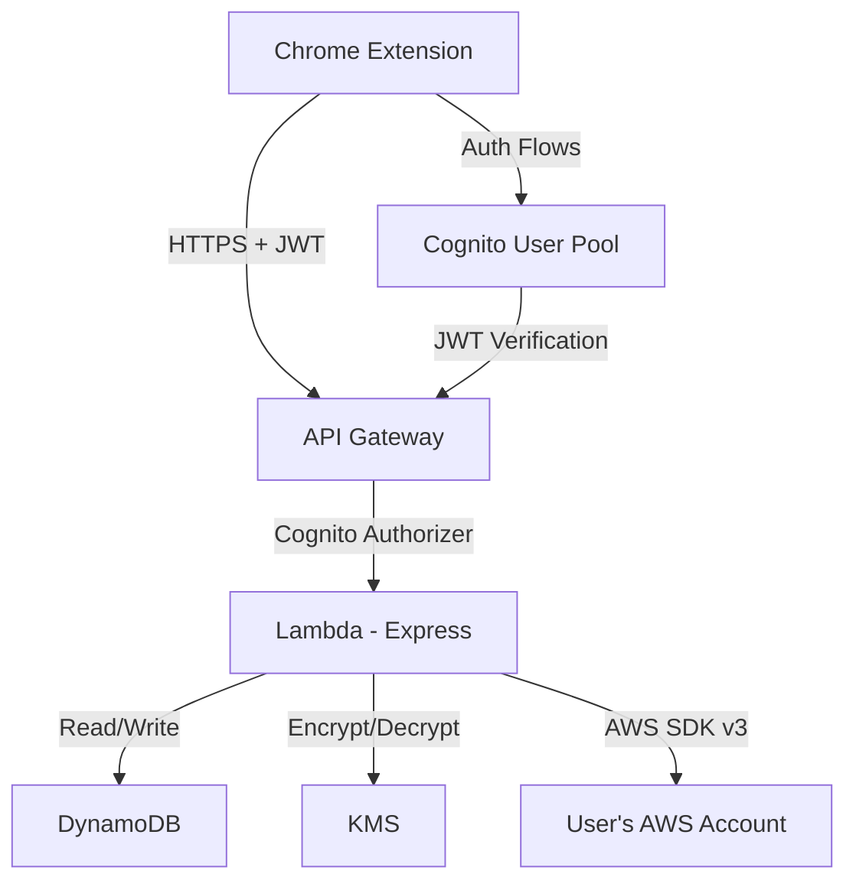

# AWS Console Better — Architecture

## System Overview

AWS Console Better is a full-stack application consisting of three main components:

1. **Chrome Extension (Frontend)** — Injected into AWS Console pages, provides UI enhancements and communicates with the backend
2. **Backend API** — Node.js/Express Lambda that executes AWS SDK operations on behalf of users using their stored credentials
3. **Infrastructure** — AWS serverless services (Lambda, API Gateway, DynamoDB, Cognito, KMS)

```
┌─────────────────────────────────────────────────────────────────────┐
│                      Chrome Extension (Frontend)                     │
│                                                                      │
│  ┌──────────────┐  ┌──────────────────┐  ┌────────────────────────┐│
│  │   Content     │  │    Extension     │  │      Side Panel        ││
│  │   Scripts     │  │    Popup         │  │      (Main UI)         ││
│  │              │  │                  │  │                        ││
│  │ • Quick Copy │  │ • Account Switch │  │ • Cross-Region Views  ││
│  │ • Context    │  │ • Quick Actions  │  │ • Copy to Region      ││
│  │   Detection  │  │ • Settings       │  │ • Environment Mgmt    ││
│  │ • UI Overlay │  │ • Auth (Login/   │  │ • Action History      ││
│  │   Buttons    │  │   Register)      │  │ • Resource Details    ││
│  │ • Show CLI   │  │                  │  │ • Quick Actions       ││
│  └──────┬───────┘  └────────┬─────────┘  └────────┬─────────────┘│
│         │                   │                      │              │
│         └───────────────────┼──────────────────────┘              │
│                             │                                      │
│                    ┌────────▼────────┐                             │
│                    │  Background     │                             │
│                    │  Service Worker │                             │
│                    │  (API Client +  │                             │
│                    │   Auth State)   │                             │
│                    └────────┬────────┘                             │
└─────────────────────────────┼─────────────────────────────────────┘
                              │ HTTPS (JWT Auth)
                              ▼
┌─────────────────────────────────────────────────────────────────────┐
│                    API Gateway (REST)                                 │
│                    + Cognito Authorizer                               │
└─────────────────────────────┬───────────────────────────────────────┘
                              │
                              ▼
┌─────────────────────────────────────────────────────────────────────┐
│                     Lambda (Express Monolith)                        │
│                                                                      │
│  ┌──────────┐  ┌──────────────────┐  ┌──────────────────────────┐  │
│  │  Auth     │  │  AWS Service     │  │  Account/Credential      │  │
│  │  Middleware│  │  Controllers     │  │  Management              │  │
│  │ (Cognito) │  │                  │  │                          │  │
│  │          │  │ • EC2 Controller │  │ • CRUD AWS accounts      │  │
│  │          │  │ • S3 Controller  │  │ • Encrypt/decrypt creds  │  │
│  │          │  │ • Lambda Ctrl    │  │ • Multi-account support  │  │
│  │          │  │ • DynamoDB Ctrl  │  │                          │  │
│  │          │  │ • IAM Controller │  │                          │  │
│  │          │  │ • CF Controller  │  │                          │  │
│  │          │  │ • ... (per svc)  │  │                          │  │
│  └──────────┘  └────────┬─────────┘  └──────────────────────────┘  │
│                         │                                            │
│              ┌──────────▼──────────┐                                 │
│              │  AWS Client Factory │                                 │
│              │  (Creates SDK v3    │                                 │
│              │   clients with      │                                 │
│              │   user's creds)     │                                 │
│              └──────────┬──────────┘                                 │
└─────────────────────────┼───────────────────────────────────────────┘
                          │
            ┌─────────────┼─────────────┐
            ▼             ▼             ▼
┌───────────────┐ ┌─────────────┐ ┌──────────────┐
│   DynamoDB    │ │    KMS      │ │  User's AWS  │
│               │ │             │ │  Account(s)  │
│ • Users       │ │ • Encrypt/  │ │              │
│ • AWS Accts   │ │   decrypt   │ │ (EC2, S3,    │
│ • History     │ │   creds     │ │  Lambda,     │
│ • Bookmarks   │ │             │ │  DDB, etc.)  │
│ • Preferences │ │             │ │              │
└───────────────┘ └─────────────┘ └──────────────┘
```

---

## Component Breakdown

### 1. Chrome Extension (Frontend)

**Responsibility**: Provide UI enhancements on AWS Console pages and communicate with the backend API for AWS operations.

#### Content Scripts

- **Injected into**: `*.console.aws.amazon.com/*`
- **Purpose**: Detect current AWS service/resource, inject UI overlays (quick copy toolbar, action buttons, "Show as CLI" button)
- **Client-side only**: Quick copy operations, context detection, UI rendering
- **Communicates with**: Background service worker via Chrome messaging API

#### Extension Popup

- **Purpose**: Quick access panel for account switching, settings, and shortcuts
- **Contains**: Login/register forms, AWS account selector, quick settings

#### Side Panel

- **Purpose**: Main UI for complex operations
- **Contains**: Cross-region resource views, copy-to-region workflows, environment manager, action history, resource details
- **Communicates with**: Background service worker for API calls

#### Background Service Worker

- **Purpose**: Central communication hub, manages auth state, makes API calls
- **Contains**: API client (TanStack Query), auth token management, Chrome storage management
- **Communicates with**: Backend API via HTTPS, content scripts and popup/sidepanel via Chrome messaging

### 2. Backend API

**Responsibility**: Execute AWS SDK operations on behalf of users using their stored credentials. Manage user accounts, AWS credentials, and action history.

#### Authentication Layer

- Cognito JWT verification middleware
- All endpoints require authentication (except register/login)

#### AWS Client Factory

- Creates AWS SDK v3 clients dynamically using stored user credentials
- Supports temporary session tokens
- Handles credential decryption from DynamoDB via KMS

#### Service Controllers

- One controller per AWS service (EC2, S3, Lambda, DynamoDB, IAM, CloudFormation, etc.)
- Each controller exposes operations: list, describe, copy-to-region, quick actions
- Controllers use the AWS Client Factory to create service-specific clients

#### Account/Credential Management

- CRUD operations for AWS accounts
- Credentials encrypted with KMS before storage in DynamoDB
- Support for multiple AWS accounts per user

### 3. Infrastructure

**Responsibility**: Host and run all backend services using AWS serverless architecture.

#### Services Used

| Service                | Purpose                                          |
| ---------------------- | ------------------------------------------------ |
| **API Gateway (REST)** | HTTP endpoint for the backend API                |
| **Lambda**             | Runs the Express monolith                        |
| **DynamoDB**           | Stores users, AWS accounts, history, preferences |
| **Cognito User Pool**  | User authentication for extension users          |
| **KMS**                | Encrypts/decrypts stored AWS credentials         |
| **CloudWatch**         | Logging and monitoring                           |
| **SAM CLI**            | Infrastructure as Code and deployment            |

---

## Data Flow

### Authentication Flow

```
1. User opens extension popup → clicks "Register" or "Login"
2. Extension sends credentials to POST /auth/register or POST /auth/login
3. Backend validates with Cognito → returns JWT tokens (access + refresh)
4. Extension stores tokens in chrome.storage.local
5. All subsequent API calls include JWT in Authorization header
6. Backend middleware verifies JWT with Cognito on every request
```

### AWS Account Setup Flow

```
1. User navigates to Settings → AWS Accounts in extension
2. User enters: Account Name, Access Key ID, Secret Access Key, (optional) Session Token, Default Region
3. Extension sends to POST /accounts
4. Backend encrypts credentials using KMS
5. Backend stores encrypted credentials in DynamoDB (aws-accounts table)
6. Returns account ID to extension
7. Extension stores active account ID in chrome.storage.local
```

### AWS Operation Flow (e.g., "Copy S3 Bucket to Region")

```
1. User is on S3 bucket page in AWS Console
2. Content script detects: service=s3, resource=my-bucket, region=us-east-1
3. User clicks "Copy to Region" button (injected by content script)
4. Side panel opens with region selector
5. User selects eu-west-1 and clicks "Copy"
6. Background service worker calls: POST /aws/s3/buckets/copy
   Body: { sourceBucket: "my-bucket", sourceRegion: "us-east-1", targetRegion: "eu-west-1", accountId: "acc_123" }
7. Backend:
   a. Verifies JWT
   b. Fetches user's AWS credentials for acc_123 from DynamoDB
   c. Decrypts credentials using KMS
   d. Creates S3 client for us-east-1 → describes bucket config
   e. Creates S3 client for eu-west-1 → creates bucket with same config
   f. Logs action to history table
   g. Returns success/failure
8. Extension shows success notification
```

### Client-Side Only Flow (e.g., "Quick Copy ARN")

```
1. User is on any AWS resource page
2. Content script detects resource identifiers from DOM/URL
3. User clicks "Copy ARN" on floating toolbar
4. Content script copies ARN to clipboard using navigator.clipboard API
5. Shows brief "Copied!" toast notification
6. No backend call needed
```

---

## Technology Stack

| Layer                       | Technology                   | Version |
| --------------------------- | ---------------------------- | ------- |
| **Extension**               | Chrome Manifest V3           | Latest  |
| **Extension UI**            | React 18 + TypeScript        | 18.x    |
| **Extension Build**         | Vite + CRXJS                 | Latest  |
| **Extension Styling**       | Tailwind CSS                 | 3.x     |
| **Extension State**         | Zustand                      | Latest  |
| **Extension Data Fetching** | TanStack Query               | Latest  |
| **Backend Runtime**         | Node.js + TypeScript         | 20.x    |
| **Backend Framework**       | Express                      | 4.x     |
| **Backend Validation**      | Joi                          | Latest  |
| **AWS SDK**                 | AWS SDK for JavaScript v3    | Latest  |
| **Database**                | DynamoDB                     | -       |
| **Auth**                    | Amazon Cognito               | -       |
| **Encryption**              | AWS KMS                      | -       |
| **IaC**                     | AWS SAM CLI + CloudFormation | Latest  |
| **Testing**                 | Jest + React Testing Library | Latest  |
| **Linting**                 | ESLint + Prettier            | Latest  |
| **Commit Hooks**            | Husky + commitlint           | Latest  |

---

## Security Considerations

### Credential Security

- AWS credentials are **never stored in plaintext**
- All credentials encrypted using AWS KMS before storage in DynamoDB
- KMS key has restricted IAM policy (only the Lambda execution role can use it)
- Credentials are decrypted only in-memory during request processing
- No credentials are ever logged or included in error responses

### Authentication

- Extension users authenticate via Cognito (JWT)
- All API endpoints require valid JWT (except auth endpoints)
- Tokens stored in `chrome.storage.local` (encrypted at rest by Chrome)
- Refresh token rotation for session management

### API Security

- HTTPS only (enforced by API Gateway)
- CORS restricted to Chrome Extension origin
- Rate limiting via API Gateway throttling
- Input validation on all endpoints (Joi)
- No sensitive data in URL parameters

### Extension Security

- Content Security Policy (CSP) in manifest.json
- Minimal permissions requested (only `*.console.aws.amazon.com`)
- No inline scripts or eval()
- All external communication via background service worker only

---

## Scalability Notes

- **Lambda**: Auto-scales with request volume
- **DynamoDB**: On-demand capacity mode for unpredictable traffic
- **API Gateway**: Handles burst traffic with throttling
- **KMS**: Managed service, scales automatically
- **Extension**: Client-side rendering, no server load for UI
- **Future**: Can add caching layer (ElastiCache) for frequently accessed resource data

---

## Key Components and Their Interactions



---

## External Dependencies

| Dependency     | Purpose                 | Management           |
| -------------- | ----------------------- | -------------------- |
| AWS SDK v3     | Execute AWS operations  | npm, pinned versions |
| React 18       | Extension UI framework  | npm, pinned versions |
| Vite + CRXJS   | Extension build tool    | npm, pinned versions |
| Tailwind CSS   | Styling                 | npm, pinned versions |
| Zustand        | State management        | npm, pinned versions |
| TanStack Query | Data fetching/caching   | npm, pinned versions |
| Express        | Backend framework       | npm, pinned versions |
| Joi            | Input validation        | npm, pinned versions |
| Chrome APIs    | Extension functionality | Chrome Manifest V3   |
| dayjs          | Date utility            | npm, pinned versions |

---

## Recent Significant Changes

| Date       | Change                                                             | Reason                                                                      |
| ---------- | ------------------------------------------------------------------ | --------------------------------------------------------------------------- |
| 2026-03-09 | Initial architecture defined                                       | Project kickoff                                                             |
| 2026-03-09 | Switched from client-side CLI terminal to backend API architecture | User requirement: backend should handle AWS operations, not client-side SDK |

---

## Additional Documentation

- `ROADMAP.md` — Full feature roadmap with all AWS services
- `API_SCHEMA.md` — Complete API endpoint documentation
- `TOOLS_AND_TECH.md` — Detailed technology decisions
- `TASK_LOG.md` — Current and completed tasks
- `DECISIONS.md` — Architecture Decision Records
